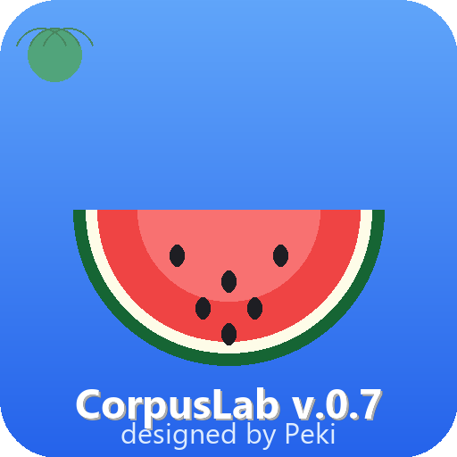
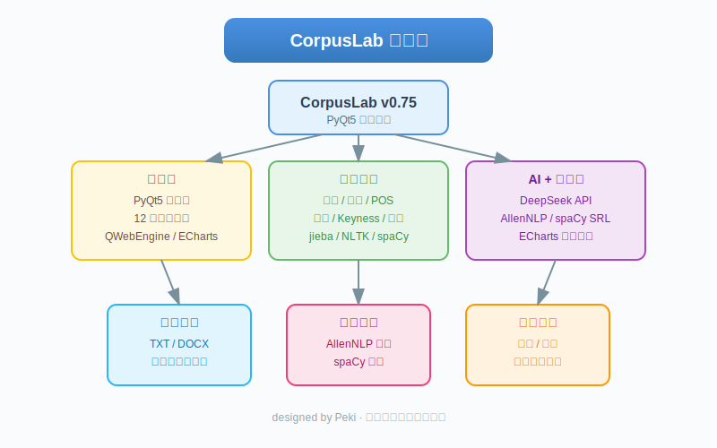
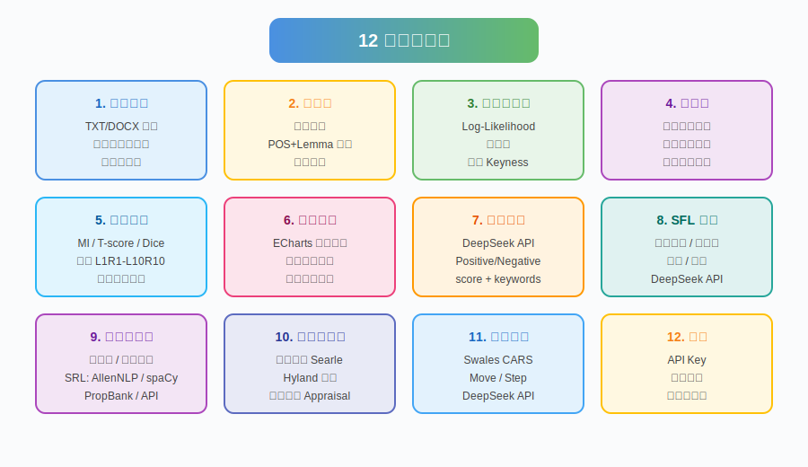
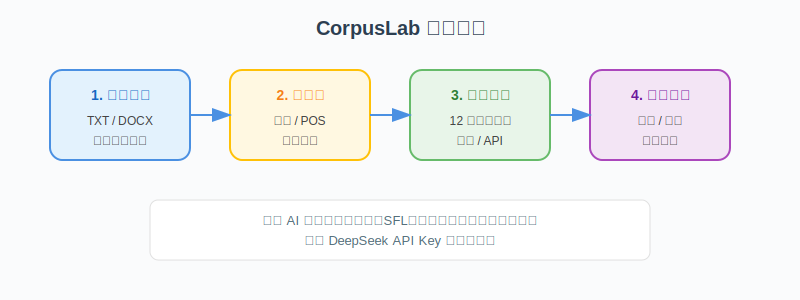

<p align="center">
  
</p>

<h1 align="center">CorpusLab v0.75</h1>

<p align="center">
  <b>一款小清新风格的语料库综合分析桌面应用</b><br>
  <i>designed by Peki</i>
</p>

<p align="center">
  
  
  
  
</p>

---

## 项目简介

**CorpusLab** 是一款基于 **PyQt5 + ECharts** 的语料库综合分析桌面应用，专为语言学研究、文本分析和语料处理设计。应用支持中英文语料，内置 12 大功能模块，从基础的词频统计、搭配分析，到高阶的语义角色标注、语用学标注、语步分析，一应俱全。



---

## 核心功能

CorpusLab 目前提供 **12 个独立分析页面**：

| 序号 | 功能模块 | 核心能力 |
|:----:|:--------|:---------|
| 1 | **语料管理** | 加载 TXT/DOCX 文件，自动检测中英文，支持停用词过滤与语料预览 |
| 2 | **频率表** | 词频统计、POS+Lemma 频率、标签频率（`<类别_值>` 模式） |
| 3 | **关键词分析** | 目标语料 vs 参考语料，Log-Likelihood / 频率比、标签 Keyness |
| 4 | **索引行** | 多词共现检索，支持引号短语与精确匹配，彩色高亮标记 |
| 5 | **搭配分析** | MI / T-score / Dice / 频率，窗口 L1R1–L10R10 可调 |
| 6 | **搭配网络** | ECharts 力导向图，黑白论文风格节点，无限链式展开 |
| 7 | **情感分析** | DeepSeek API，输出 Positive/Negative/Neutral/Mixed + score |
| 8 | **SFL 标注** | DeepSeek API，识别过程类型、参与者、环境、主位 |
| 9 | **语义学标注** | 上位词（WordNet）、语义角色（AllenNLP / spaCy / PropBank / API） |
| 10 | **语用学标注** | 言语行为（Searle）、Hyland 立场、评价理论（Appraisal） |
| 11 | **语步标注** | Swales CARS 模型，识别 Move / Step |
| 12 | **设置** | 配置 API Key、选择模型、中英文切换 |



---

## 使用流程



1. **加载语料**：导入 TXT 或 DOCX 文件，系统自动检测中英文。
2. **预处理**：完成分词、POS 标注、停用词过滤等基础处理。
3. **选择分析**：在顶部导航切换至需要的功能页面。
4. **查看结果**：结果以表格、图表或网络图形式展示，支持导出。

> **提示**：AI 标注功能（情感、SFL、语义、语用、语步）需要先在 **设置** 页面配置 DeepSeek API Key。

---

## 技术栈

- **GUI 框架**：PyQt5 + QWebEngine
- **可视化**：ECharts（搭配网络）
- **中文分词**：jieba
- **英文 NLP**：NLTK / spaCy / WordNet / FrameNet
- **语义角色标注**：AllenNLP（BERT-SRL）/ spaCy dependency parsing
- **AI 标注**：DeepSeek API
- **打包工具**：PyInstaller

---

## 本地运行

### 环境要求

- Python 3.13
- Git（可选，用于版本管理）

### 安装步骤

```bash
# 1. 进入项目目录
cd CorpusLab

# 2. 创建虚拟环境
python -m venv corpuslab

# 3. 激活环境（Windows）
corpuslab\Scripts\activate

# 4. 安装依赖
pip install -r requirements.txt

# 5. 下载 spaCy 英文模型
python -m spacy download en_core_web_sm

# 6. 运行应用
python main.py
```

---

## 可选：启用 AllenNLP SRL

如果你希望使用本地 **AllenNLP BERT-SRL** 进行语义角色标注，需要额外准备 Python 3.10 环境：

```bash
# 创建 allennlp 环境
python3.10 -m venv allennlp_env

# 安装 AllenNLP 与模型
allennlp_env\Scripts\pip install allennlp==2.10.1 allennlp-models==2.10.1 spacy
allennlp_env\Scripts\python -m spacy download en_core_web_sm
```

运行 CorpusLab 时，程序会自动检测同目录下的 `allennlp_env` 文件夹，并优先使用该环境执行 SRL。

---

## 打包为可执行文件

```bash
# 安装 PyInstaller
pip install pyinstaller

# 执行打包
python -m PyInstaller CorpusLab.spec
```

打包完成后，**务必将 `allennlp_env` 目录复制到 `dist/CorpusLab/` 下**，否则 AllenNLP SRL 功能将无法使用。

```bash
xcopy /E /I allennlp_env dist\CorpusLab\allennlp_env
```

---

## 项目结构

```
CorpusLab/
├── main.py                    # 应用入口
├── gui/
│   └── main_window.py         # 主窗口与所有页面逻辑
├── corpus/
│   └── collocation.py         # 搭配引擎
├── corpus_engine.py           # 频率 / POS / 关键词 / 索引行
├── corpus_loader.py           # TXT/DOCX 文件加载
├── deepseek_client.py         # DeepSeek API 客户端
├── i18n.py                    # 中英文翻译
├── config.py                  # 配置持久化
├── allennlp_srl_bridge.py     # AllenNLP SRL 子进程桥接脚本
├── spacy_srl_bridge.py        # spaCy SRL 子进程桥接脚本
├── CorpusLab.spec             # PyInstaller 打包配置
├── requirements.txt           # Python 依赖
├── web/                       # ECharts 网络可视化页面
├── screenshots/               # README 配图
├── README.md                  # 本文件
└── logo.png                   # 应用 Logo
```

---

## 界面截图（占位）

> 以下位置可替换为真实应用截图：

<p align="center">
  
</p>

<p align="center">
  
</p>

---

## 注意事项

- 项目中使用 `t` 作为 i18n 翻译函数，请避免在方法内部使用 `t` 作为局部变量名，否则会导致 `UnboundLocalError`。
- 搭配网络页面必须通过 `QUrl.fromLocalFile()` 加载 HTML，不能直接使用 `setHtml()`，否则相对路径的 `echarts.min.js` 无法解析。
- `.workbuddy/` 目录存储项目相关数据，请勿删除。

---

## 开源协议

本项目采用 [MIT License](LICENSE) 开源协议。

---

<p align="center">
  <b>designed by Peki</b>
</p>
